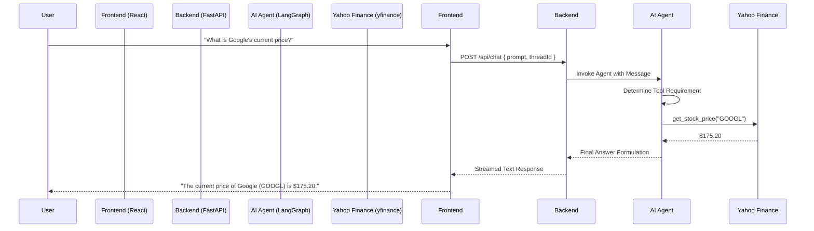

# AI Stock Analysis Assistant - Technical Documentation

## 1. Project Overview
The **AI Stock Analysis Assistant** is a full-stack application designed to provide users with intelligent, real-time insights into financial markets. By combining a natural language interface with robust financial data APIs, it allows users to perform complex stock analysis through simple conversation.

## 2. Technical Stack

### Backend
- **Framework**: [FastAPI](https://fastapi.tiangolo.com/) (Python)
- **AI Orchestration**: [LangChain](https://www.langchain.com/) & [LangGraph](https://langchain-ai.github.io/langgraph/)
- **Large Language Model**: GPT-5 Preview (via Thesys API)
- **Data Source**: [yfinance](https://github.com/ranaroussi/yfinance) (Yahoo Finance API wrapper)
- **Environment Management**: `python-dotenv`
- **Server**: `uvicorn`

### Frontend
- **Framework**: [React](https://reactjs.org/) with [TypeScript](https://www.typescriptlang.org/)
- **Build Tool**: [Vite](https://vitejs.dev/)
- **UI Components**: [@thesysai/genui-sdk](https://www.thesys.ai/) (C1Chat component)
- **Design System**: [@crayonai/react-ui](https://crayon.ai/)

---

## 3. System Architecture

### 3.1 Backend Architecture (`backend/main.py`)
The backend operates as a stateless FastAPI server that manages an intelligent agent.

- **The Agent**: Created using `langchain.agents.create_agent`. It acts as the "brain," interpreting user input and determining which tools to execute.
- **Checkpointing**: Uses `langgraph.checkpoint.memory.InMemorySaver` to maintain thread-based memory, allowing for multi-turn conversations (e.g., "What is AAPL's price?" followed by "Show me its news").
- **Streaming**: The `/api/chat` endpoint utilizes `StreamingResponse` to deliver tokens to the frontend as they are generated, ensuring a low-latency user experience.

### 3.2 Frontend Architecture (`frontend/src/`)
The frontend is a modern React application focused on providing a seamless chat interface.

- **GenUI Integration**: The core of the UI is the `C1Chat` component, which handles the complex rendering of chat bubbles, streaming text, and interaction with the backend API.
- **Styling**: Uses a dark-themed CSS architecture with professional financial aesthetics.

---

## 4. Key Features & Tools

The AI Assistant is equipped with specialized tools to fetch and process financial data:

### 4.1 Real-Time Stock Price (`get_stock_price`)
- **How it works**: Uses `yfinance.Ticker(ticker).history()` to retrieve the most recent closing price.
- **Trigger**: Activated when a user asks for the current price of a specific symbol.

### 4.2 Historical Performance (`get_historical_stock_price`)
- **How it works**: Fetches historical OHLC (Open, High, Low, Close) data for a given date range.
- **Trigger**: Used for queries like "How did Tesla perform in 2023?"

### 4.3 Balance Sheet Analysis (`get_balance_sheet`)
- **How it works**: Extracts the balance sheet data using `yfinance`.
- **Trigger**: Activated for fundamental analysis questions regarding assets, liabilities, and equity.

### 4.4 Market News (`get_stock_news`)
- **How it works**: Retrieves the latest news headlines and URLs linked to a ticker.
- **Trigger**: Used when users ask "What's the latest news on Nvidia?"

---

## 5. Data Flow



---

## 6. API Documentation

### POST `/api/chat`
Handles all chat interactions.

**Request Body:**
```json
{
  "prompt": {
    "content": "string",
    "id": "string",
    "role": "user"
  },
  "threadId": "string",
  "responseId": "string"
}
```

**Response:**
- A `text/event-stream` returning the AI's response token-by-token.

---

## 7. Setup & Installation

### Backend Setup
1. Navigate to `/backend`.
2. Install dependencies: `pip install -e .` (assuming a pyproject.toml setup).
3. Create a `.env` file with your `OPENAI_API_KEY` and any necessary base URLs.
4. Run the server: `python main.py`.

### Frontend Setup
1. Navigate to `/frontend`.
2. Install dependencies: `npm install`.
3. Start the dev server: `npm run dev`.
4. Ensure the Vite proxy is configured to point to the backend (usually handles via `vite.config.ts`).

---

## 8. Development Observations
- The use of **LangGraph** ensures that the agent follows a predictable logic flow.
- **GenUI SDK** significantly reduces frontend complexity by handling the chat state internally.
- **yfinance** is used as a free data source, which is excellent for tutorials but may require a more robust API (like Bloomberg or Alpha Vantage) for production-grade high-frequency data.
